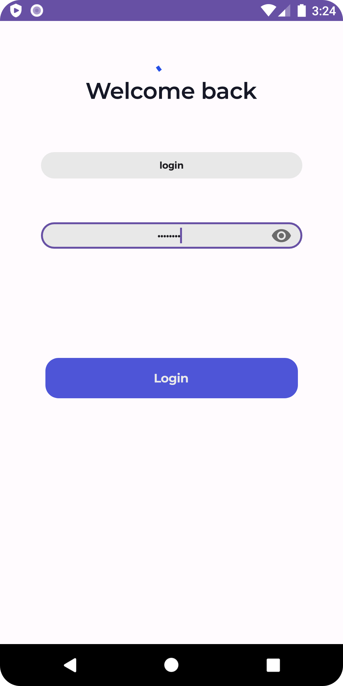
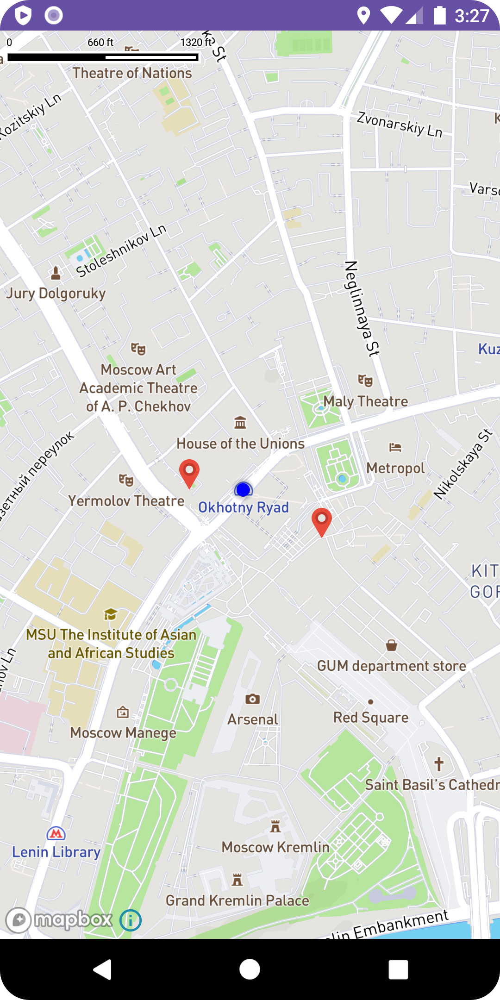
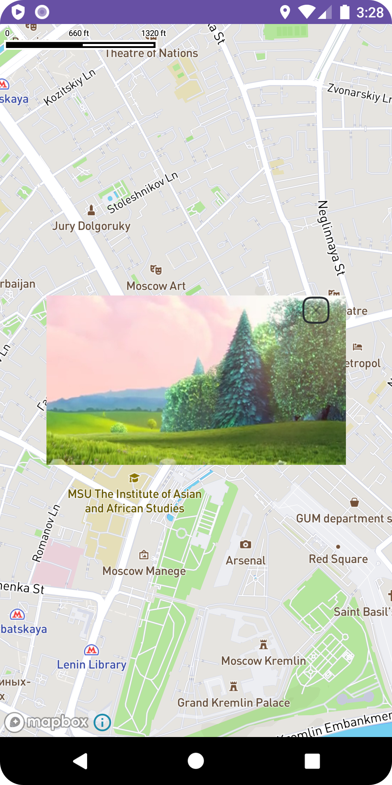

# Проект по тестовому заданию на вакансию Android-разработчик

### Описание задания:

Задание заключается в создании приложения для платформы Android, имеющего внутри себя три основных функции: авторизация, просмотр карты и просмотр видеопотока.

При попадании в приложение пользователь должен ввести данные для входа. После этого пользователь попадает на карту (например, Москвы) где отображается набор маркеров. При клике на маркер открывается всплывающее окно, внутри которого отображается потоковое видео.

### Запуск проекта

Для работы проекта требуется настройка учетных данных MapBox:
1. Установить секретный токен в переменную окружения в файле ```«USER_HOME»/.gradle/gradle.properties```
2. Общедоступный токен необходимо также заменить своим: файл ```tokens.xml``` в строковых ресурсах модуля ```feature-maps``` в директории ```values```.

Подробнее о настройке учетных данных для MapBox по ссылке https://docs.mapbox.com/android/maps/guides/install/

### Демонстрация:

<table>
  <tr>
    <th width="33%">Экран логина</th>
    <th width="33%">Экран карты с местоположением пользователя и маркерами</th>
    <th width="34%">Демонстрация видео на карте</th>
  </tr>
  <tr>
    <td align="center"></td>
    <td align="center"></td>
    <td align="center"></td>
  </tr>
</table>

### Реализация:
- В моем представлении авторизация клиента происходит на сервере, внутри клиента никаких проверок нет (кроме как обработать ошибки сервера).
  Поэтому имитируем отправку введенных логина и пароля на сервер и считаем, что учетные данные введены верно. Запрос отправляется по пути
  https://gist.githubusercontent.com/PoddubniySerg/595c8bad76bd0f51eac7032abe4b6fd6/raw/ec9225555b016339fb223b44b42f2ff3c47f6e64/token.json.
  В ответ получаем сгенерированный онлайн JWT токен. Далее этот токен устанавливаем в заголовок 'X-Authorization' посредством OkHttpInterceptor.
- Данные для маркеров карты в формате GeoJSON получаем по запросу на https://gist.githubusercontent.com/PoddubniySerg/ec24e9a786fa3d91201a1c7e70f13bbf/raw/356978c7053b610b373f877d8eb530d293092e9f/markers.json
- Учитывая условие свести к минимуму использование сторонних библиотек, внедрение зависимостей выполнено без какого-либо фреймворка.С целью экономии времени соблюдением жизненного цикла компонентов решено пренебречь.
- Для навигации между фрагментами использована библиотека androidx.navigation. Она достаточно простая и удобная, позволит масштабировать проект с минимальными трудозатратами.
- Для сохранения токена в SharedPreferences использовал рекомендуемую гуглом библиотеку androidx.datastore.
- Retrofit2 с конвертером Moshi для работы с сетевыми запросами. Тоже сильно упрощает общение с сервером и делает код более понятным.
- Mapbox Maps SDK для Android - это библиотека для встраивания настраиваемых карт в приложения Android.
- ExoPlayer это библиотека с открытым исходным кодом, поддерживаемая Google.
  Он поддерживает широкий спектр медиа-файлов, включая Dash и HLS Streaming, которая не поддерживается Медиаплеер.
  ExoPlayer обеспечивает плавное шифрование и потоковую передачу видео- и аудиофайлов.